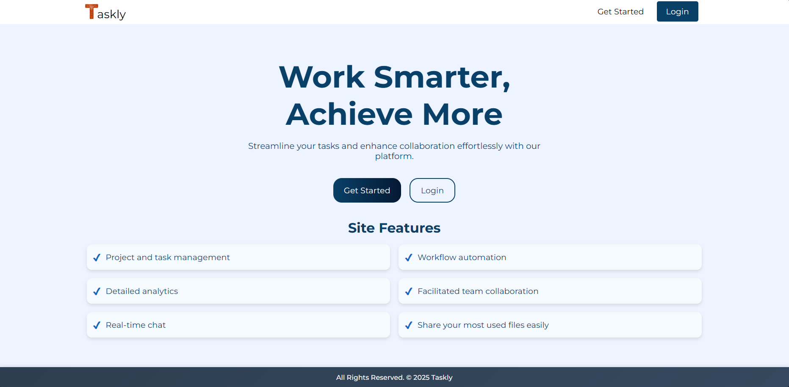
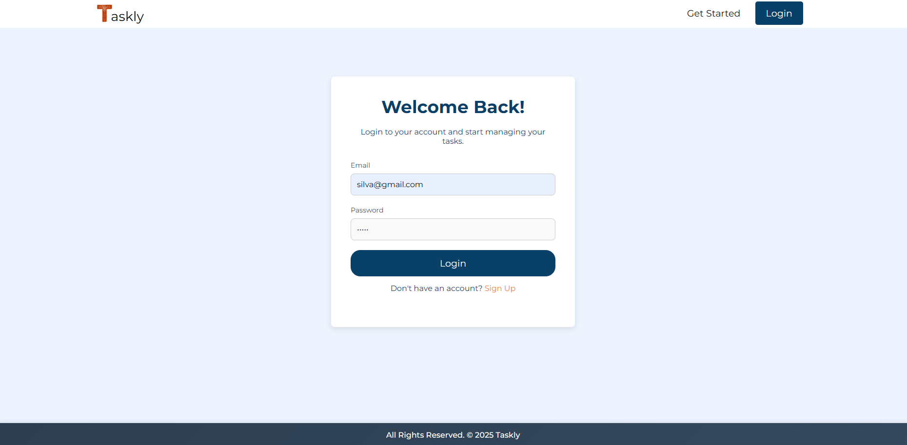
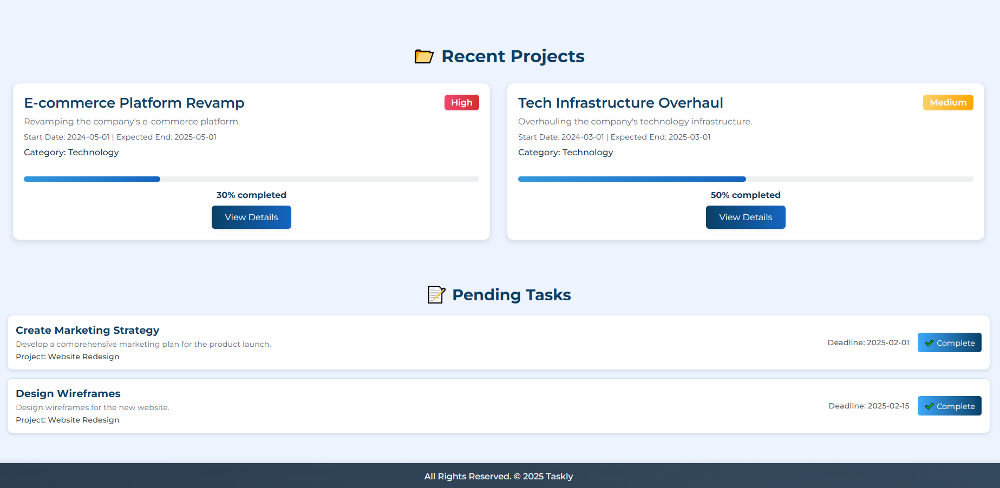
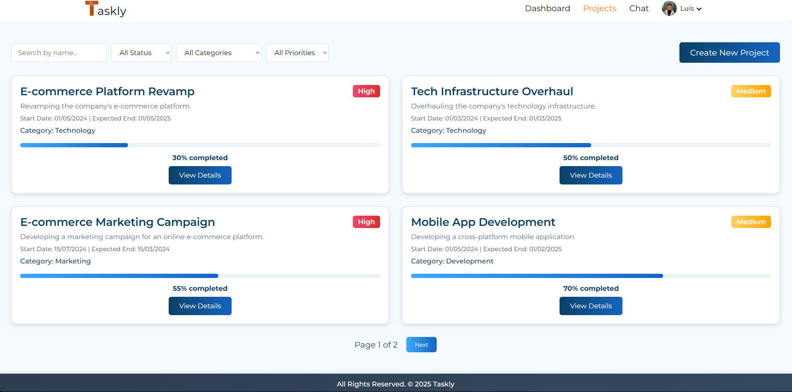

# Taskly - Project Management Platform

Taskly is a platform designed to streamline project management and team communication. It allows users to create projects, assign tasks, and track progress while offering a built-in chat system for real-time collaboration.

## Features

- **User Authentication**: Users can register, log in, and log out of their accounts.
- **Home Page**: Users are greeted with an overview of their workspace.
- **Dashboard**: Visualize statistics, recent Projects and pending Tasks.
- **Projects Involvement**: Users can see all projects they are involved in.
- **General Chat**: Engage with team members through a general chat.
- **Project Information**: Each project includes detailed information, such as description, deadlines, and team members.
- **Project Tasks**: View and manage tasks associated with a specific project.
- **Task Comments**: Collaborate with team members by leaving comments on tasks.

## Technologies Used

- **Frontend**:

  - **VueJS** - JavaScript framework for building user interfaces.
  - **HTML** - Structure of the web application.
  - **CSS** - For styling the website.
  - **JavaScript** - Used for client-side logic and interactivity.

- **Backend**:
  - **Docker** - A containerization platform used to package and deploy the application in lightweight, isolated environments, ensuring consistency across different environments.
  - **Java** - Programming language used for backend development.
  - **Spring Boot** - Framework for building the backend API and handling HTTP requests.
  - **Spring Data JPA** - Simplifies database interaction by providing an abstraction layer for managing data persistence.
  - **Spring Security** - Provides user authentication and authorization, securing an application.
  - **Spring Validation** - A framework used for validating input data, ensuring that the data received by the application meets the defined rules.
  - **WebSockets** - Used for real-time communication between the client and the server.
  - **PostgreSQL** - Relational database used to store project, tasks, users, and other essential data.
  - **JWT (JSON Web Tokens)** - For user authentication and secure communication between the frontend and backend.

## How to Run the Project Locally

### Installation Steps

1. **Clone the repository:**

   ```bash
   git clone https://github.com/LuisSilva7/taskly-project.git
   ```

2. **Navigate to the project backend directory:**

   ```bash
   cd taskly-project/taskly-backend
   ```

3. **Run MySQL container:**

   ```bash
   docker compose up -d
   ```

4. **Run the backend server:**

   ```bash
   mvn spring-boot:run
   ```

5. **Navigate to the project frontend directory:**

   ```bash
   cd ../taskly-frontend
   ```

6. **Install project dependencies:**

   ```bash
   npm install
   ```

7. **Start the development server:**

   ```bash
   npm run dev
   ```

8. **Clear the LocalStorage:**
   Clear your LocalStorage to make sure everything is working.

The application will be available at [http://localhost:5000](http://localhost:5000) in your browser.

### Docker Setup (Optional)

If you prefer to run the application inside a Docker container, follow these steps:

1. **Navigate to the project backend directory:**

   ```bash
   cd taskly-project/taskly-backend
   ```

2. **Build the Docker backend image:**

   ```bash
   docker build -t taskly-backend-project -f ../docker-taskly/backend/Dockerfile .
   ```

3. **Navigate to the project frontend directory:**

   ```bash
   cd ../taskly-frontend
   ```

4. **Build the Docker frontend image:**

   ```bash
   docker build -t taskly-frontend-project -f ../docker-taskly/frontend/Dockerfile .
   ```

5. **Run all containers:**

   ```bash
   docker compose -f ../docker-taskly/docker-compose.yml up -d
   ```

6. **Clear the LocalStorage:**
   Clear your LocalStorage to make sure everything is working.

The application will be available at [http://localhost:8080](http://localhost:8080) in your browser.

## Screenshots

### Home Page



### Login Page



### Dashboard Page



### Projects Page



### Maintainer

- **Luis Silva** (Owner/Developer)
